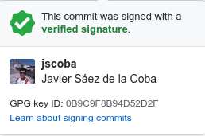
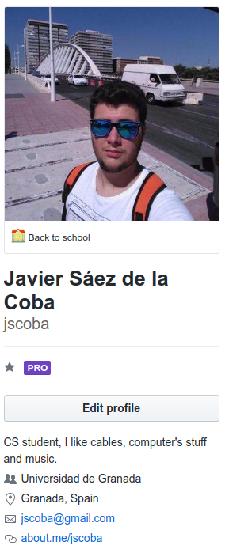
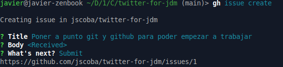

# Documentación Hito 0

Para el hito 0 de CC se pide una serie de items a realizar. En este documento se explica como se han alcanzado.

- [x] Creación de par de claves y subida de clave pública a GitHub.

Este item ya lo tenía preparado de antes, ya que hace tiempo configuré la verificación en dos pasos, la clave GPG y la clave SSH en github.

 

- [x] Configuración correcta del nombre y correo electrónico para que aparezca en los commits correctamente.
- [x] Edición del perfil en GitHub para que aparezca nombre completo y ciudad, así como universidad.

También lo tenía casi completo, a falta de poner Universidad de Granada. Además he añadido una bio al perfil.

 

- [x] Creación de los repositorios para la asignatura

Creamos dos repositorios para la asignatura: `twitter-for-jdm` y `CC-autoevaluacion`. Además hacemos fork del repositorio `JJ/CC-20-21`. Clonamos los 3 repositorios por ssh.

- [x] Configuración del origen del repositorio común de la asignatura

Mediante git remote establecemos el origen remoto `upstream` correspondiente al repositorio original (del que hemos hecho fork) para poder traernos los cambios 

- [ ] Configuración correcta del mecanismo de pull para el repositorio común

En este repositorio ejecutamos `git config pull.rebase true`

Con esto ya tenemos nuestro repo configurado para poder empezar a trabajar correctamente en el proyecto.

- [x] Instalar la interfaz de línea de comandos de github.

La aparición de la nueva CLI de github  nos permite gestionar los issues, milestones y pull requests desde la línea de comandos. Seguimos la guía de instalación para sistemas linux disponible en [cli.github.com](cli.github.com)

